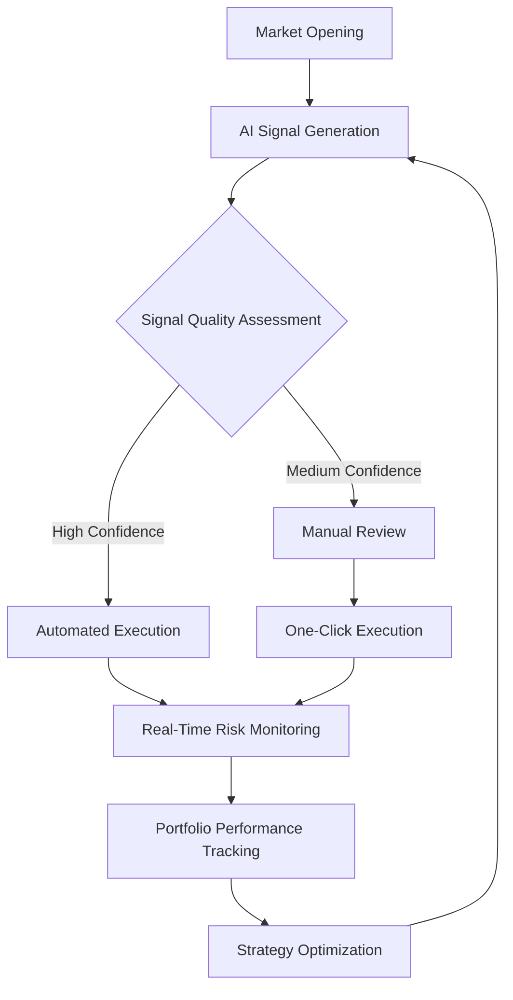
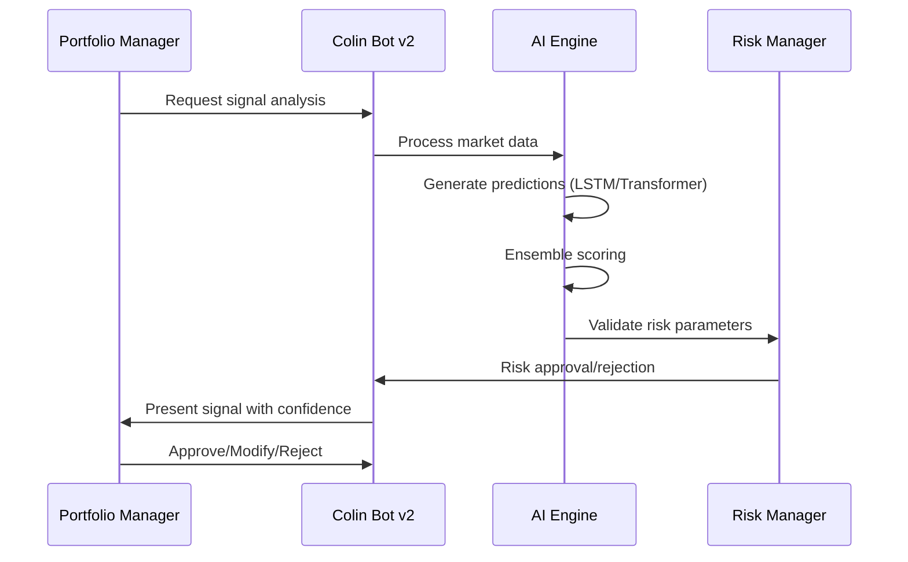
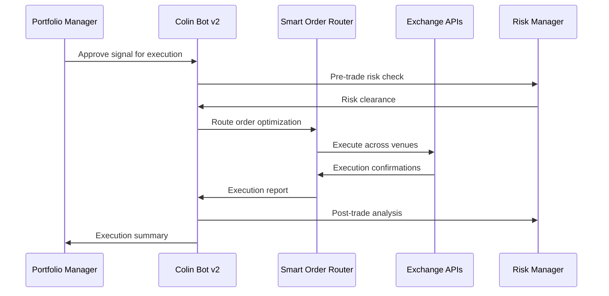
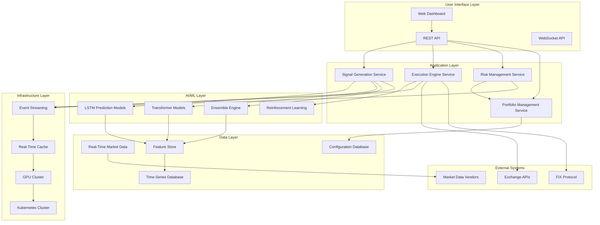
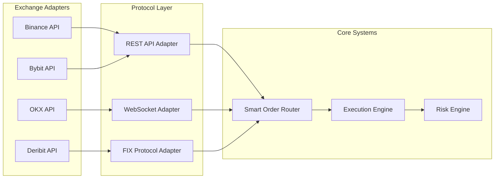

# Product Requirements Document: Colin Trading Bot v2.0

## 1. Executive Summary

### Problem Statement
Colin Trading Bot v1 is a sophisticated signal scoring system that generates institutional-grade trading signals but lacks automated execution capabilities. Users must manually execute trades, creating latency gaps, execution slippage, and operational inefficiencies that limit potential returns and scalability.

### Proposed Solution
Transform Colin Trading Bot v2.0 into an integrated AI-powered trading system that combines advanced signal generation with automated execution, institutional-grade risk management, and multi-exchange capabilities. The system will target small to medium hedge funds ($10M-500M AUM) and sophisticated individual traders seeking institutional-grade tools without institutional overhead.

### Success Criteria
- **Accuracy**: >65% directional accuracy on 15-minute price forecasts
- **Latency**: <50ms signal-to-execution time (targeting HRT-level performance)
- **Risk-Adjusted Returns**: >2.0 Sharpe ratio (industry-leading performance)
- **Capacity**: 100+ symbols simultaneous analysis with $10M+ AUM capability
- **Revenue per Employee**: Target $3-5M (Citadel: $3.1M, Jane Street: $7.8M benchmark)
- **Operating Margins**: 50%+ (Citadel: 47%, HRT: 59% benchmark)

### Resource Requirements
- **Total Investment**: $360K-720K first year
- **Timeline**: 12-18 month phased approach
- **Team**: ML/AI specialists, low-latency engineers, regulatory experts
- **Infrastructure**: AWS/GCP cloud with GPU acceleration and timeseries databases

## 2. Market Analysis

### Market Opportunity
The global algorithmic trading market is projected to grow from $18.8B (2024) to $35B by 2030, with AI adoption reaching 65% among institutional investors by 2026. Key market gaps include:

1. **Signal-to-Execution Integration**: Most platforms offer either signal generation OR execution, not both
2. **Institutional-Grade Democratization**: Limited access to hedge fund-level tools for smaller players
3. **AI-Driven Execution**: Current systems rely on rule-based execution vs. AI optimization

### Target Market Segments

#### Primary: Small to Medium Hedge Funds ($10M-500M AUM)
- **Pain Points**: Manual execution bottlenecks, limited AI capabilities, high infrastructure costs
- **Value Proposition**: Institutional-grade AI trading at 1/10th traditional cost
- **Market Size**: ~$2T AUM globally, growing 15% annually

#### Secondary: Sophisticated Individual Traders ($1M-10M portfolios)
- **Pain Points**: Limited access to advanced AI tools, execution quality issues
- **Value Proposition**: Professional-grade tools without institutional minimums
- **Market Size**: ~500K individuals globally, growing 25% annually

### Competitive Landscape

#### Institutional Platforms (High Cost, Complex)
- **Bloomberg Terminal**: $20K+/year, excellent data, limited execution
- **Refinitiv Eikon**: $15K+/year, institutional focus, high complexity
- **QuantConnect**: Platform fees + profit share, good backtesting, limited AI

#### Retail Platforms (Low Cost, Limited)
- **3Commas**: $15-75/month, basic automation, no AI optimization
- **Cryptohopper**: $20-100/month, simple strategies, limited customization
- **TradingView**: $15-60/month, excellent charts, manual execution

### Competitive Advantage
1. **Integrated AI Signal + Execution**: Only platform offering end-to-end AI-driven trading
2. **Institutional Performance at Retail Cost**: Sub-millisecond execution at affordable pricing
3. **Multi-Exchange Smart Routing**: Liquidity aggregation across 10+ exchanges
4. **Real-Time Risk Management**: Portfolio-level monitoring with automated controls

## 3. User Experience Design

### User Personas

#### Primary: Portfolio Manager (Hedge Fund)
- **Background**: 8-12 years trading experience, manages $50M-200M AUM
- **Goals**: Maximize risk-adjusted returns, reduce operational overhead, scale strategies
- **Pain Points**: Manual execution delays, limited AI insights, portfolio risk visibility
- **Technical Proficiency**: High - comfortable with APIs, quantitative analysis

#### Secondary: Quant Trader (Individual/Solo Fund)
- **Background**: 3-7 years trading experience, manages $1M-10M portfolio
- **Goals**: Access institutional tools, automate execution, improve signal accuracy
- **Pain Points**: High costs of institutional platforms, execution quality issues
- **Technical Proficiency**: Very high - often software engineers

### User Journey Mapping



### Key User Flows

#### 1. AI Signal Analysis Workflow


#### 2. Automated Execution Workflow


### Dashboard Design Requirements

#### Primary Trading Dashboard (Desktop - 90% Priority)
- **Real-Time Signal Panel**: Live AI signals with confidence scores and rationale
- **Execution Monitor**: Order status, fill rates, slippage analysis
- **Portfolio Overview**: P&L, risk metrics, position allocation
- **Market Analysis**: Multi-timeframe charts with AI annotations
- **Risk Dashboard**: Real-time VaR, drawdown, correlation matrix

#### Mobile Monitoring Dashboard (10% Priority)
- **Alert Management**: Signal notifications, risk alerts, execution confirmations
- **Portfolio Summary**: Current positions, daily P&L, risk status
- **Quick Actions**: Emergency position closure, risk limit adjustments

### Accessibility Requirements
- **Color-Blind Friendly**: Use blue/orange instead of red/green for trading indicators
- **Keyboard Navigation**: Full keyboard control for active traders
- **High Contrast Mode**: For extended trading sessions
- **Screen Reader Support**: For financial data accessibility compliance

## 4. Technical Architecture

### System Architecture Overview



### Technology Stack

#### AI/ML Infrastructure
- **Primary Framework**: PyTorch (dynamic computation, better for financial time series)
- **Secondary Framework**: TensorFlow 2.x (production deployment options)
- **Transformer Library**: Hugging Face (attention mechanisms for multi-timeframe analysis)
- **Reinforcement Learning**: Ray RLlib (proven in Two Sigma production systems)
- **Model Serving**: Triton Inference Server (GPU optimization, multiple model versions)

#### Real-Time Processing
- **Event Streaming**: Apache Kafka (1M+ events/second throughput)
- **Real-Time Cache**: Redis Streams (<1ms latency for critical paths)
- **Stream Processing**: Apache Flink (complex event processing, windowing)
- **Message Queue**: RabbitMQ (reliable message delivery)

#### Execution Engine
- **Protocol**: FIX Protocol (FIXP for low-latency execution)
- **Exchange Integration**: CCXT Pro (multi-exchange real-time websockets)
- **Smart Routing**: Custom implementation for optimal execution
- **Order Management**: In-memory order book with persistence

#### Database & Storage
- **Time-Series**: InfluxDB (optimized for market data, 1ms writes)
- **Analytics**: ClickHouse (complex queries, historical analysis)
- **Feature Store**: Feast (ML model serving, online/offline consistency)
- **Configuration**: PostgreSQL with TimescaleDB extension

#### Infrastructure & Deployment
- **Cloud Provider**: AWS (primary) or GCP (secondary)
- **Containerization**: Docker + Kubernetes (orchestration, scaling)
- **GPU Infrastructure**: NVIDIA T4 instances ($3/hour for inference)
- **Monitoring**: Prometheus + Grafana (real-time system monitoring)

### Performance Specifications

#### Latency Targets
- **Market Data Ingestion**: <1ms per tick
- **Feature Calculation**: <5ms per symbol
- **ML Inference**: <10ms per prediction
- **Risk Validation**: <5ms per order
- **Order Placement**: <20ms total signal-to-execution

#### Throughput Targets
- **Market Data Processing**: 100K+ ticks/second per symbol
- **Signal Generation**: 1000+ predictions/second
- **Order Execution**: 500+ orders/second
- **Risk Monitoring**: Real-time portfolio updates

#### Scalability Targets
- **Symbol Coverage**: 100+ simultaneous symbols
- **User Capacity**: 50+ concurrent users
- **Data Storage**: TB/day market data ingestion
- **Model Serving**: 10+ concurrent ML models

### Integration Architecture

#### Exchange Connectivity


## 5. Security & Compliance

### Security Architecture

#### Authentication & Authorization
- **Multi-Factor Authentication**: TOTP + hardware security keys
- **Role-Based Access Control**: Admin, Trader, Analyst, Read-only roles
- **API Key Management**: HSM-based key storage, automatic rotation
- **Session Management**: JWT tokens with refresh mechanism

#### Data Protection
- **Encryption**: TLS 1.3 for transit, AES-256 for data at rest
- **Key Management**: AWS KMS or HashiCorp Vault
- **Data Masking**: Sensitive PII data in logs and monitoring
- **Backup Encryption**: Encrypted backups with immutable storage

#### API Security
- **Rate Limiting**: Token bucket algorithm, per-user limits
- **Input Validation**: Comprehensive input sanitization
- **Security Headers**: CSP, HSTS, X-Frame-Options
- **API Versioning**: Backward-compatible versioning strategy

### Regulatory Compliance

#### SEC Compliance (US Markets)
- **Regulation SCI**: System compliance and integrity
- **Market Access Rule (15c3-5)**: Pre-trade risk controls
- **Best Execution**: Duty of best execution for client orders
- **Record Keeping**: 6-year retention of trading records

#### CFTC Compliance (Derivatives)
- **Risk Management Programs**: Comprehensive risk policies
- **Large Trader Reporting**: Threshold reporting requirements
- **Position Limits**: Commodity position limit monitoring
- **Anti-Manipulation**: Surveillance for market manipulation

#### MiFID II Compliance (European Markets)
- **Algorithmic Trading Controls**: Circuit breakers, kill switches
- **Transaction Reporting**: Real-time trade reporting
- **Best Execution**: Order execution policy
- **Data Recording**: Time synchronization and record keeping

#### AML/KYC Requirements
- **Customer Due Diligence**: Identity verification and risk assessment
- **Transaction Monitoring**: Real-time suspicious activity detection
- **Suspicious Activity Reports**: Automated SAR generation
- **Sanctions Screening**: OFAC and international sanctions lists

### Risk Management Framework

#### Pre-Trade Risk Controls
```python
class PreTradeRiskController:
    """Real-time pre-trade risk validation"""

    def validate_order(self, order: Order) -> RiskDecision:
        checks = [
            self.check_position_limits(order),
            self.check_margin_requirements(order),
            self.check_concentration_limits(order),
            self.check_var_limits(order),
            self.check_price_collars(order),
            self.check_trading_halts(order)
        ]

        return RiskDecision(
            approved=all(check.passed for check in checks),
            reasons=[check.reason for check in checks if not check.passed],
            warnings=[check.warning for check in checks if check.warning]
        )
```

#### Real-Time Risk Monitoring
- **Position Limits**: Per-symbol and portfolio-level position limits
- **Margin Requirements**: Real-time margin calculation and monitoring
- **VaR Calculation**: 95% and 99% VaR with 1-day and 5-day horizons
- **Stress Testing**: Historical crisis scenarios and Monte Carlo simulation
- **Correlation Monitoring**: Real-time correlation matrix and concentration risk

#### Model Risk Management
- **Model Validation**: Independent review of all ML models
- **Performance Monitoring**: Real-time model accuracy and drift detection
- **Backtesting**: Comprehensive historical validation
- **Explainability**: SHAP values and feature importance for regulatory compliance

## 6. Implementation Plan

### Phase 1: AI Enhancement (Months 1-6)

#### Months 1-2: ML Infrastructure Foundation
**Tasks**:
- Set up PyTorch + Ray RLlib development environment
- Implement Kafka + Redis streaming infrastructure
- Create feature engineering pipeline with Feast
- Establish ML model versioning with MLflow

**Deliverables**:
- ML training and inference pipeline
- Real-time data processing infrastructure
- Feature store with 50+ engineered features
- Model registry and experiment tracking

**Validation Gates**:
```bash
# ML Infrastructure Validation
python -m tests.ml_infrastructure.test_pipeline --validate
python -m tests.data_infrastructure.test_streaming --throughput=1M
```

#### Months 3-4: AI Model Development
**Tasks**:
- Implement LSTM models for 15-minute price prediction
- Create Transformer models for multi-timeframe analysis
- Develop ensemble combination methodology
- Build model validation framework

**Deliverables**:
- LSTM model with 60-minute sequence windows
- Transformer model with attention mechanisms
- Ensemble engine achieving >65% accuracy
- Comprehensive backtesting framework

**Validation Gates**:
```bash
# Model Performance Validation
python -m tests.models.test_lstm --accuracy_target=0.65
python -m tests.models.test_transformer --latency_target=10ms
```

#### Months 5-6: Signal Integration
**Tasks**:
- Integrate AI models with existing signal framework
- Implement real-time signal generation pipeline
- Create confidence scoring and rationale generation
- Develop signal quality monitoring

**Deliverables**:
- Integrated AI signal generation system
- Real-time confidence scoring with XAI
- Signal quality dashboard and alerting
- Performance analytics and reporting

**Validation Gates**:
```bash
# Signal Integration Validation
python -m tests.signals.test_integration --latency_target=20ms
python -m tests.signals.test_quality --accuracy_target=0.65
```

### Phase 2: Execution Engine (Months 7-12)

#### Months 7-8: Multi-Exchange Integration
**Tasks**:
- Implement exchange adapters for Binance, Bybit, OKX
- Create FIX protocol integration for institutional access
- Develop smart order routing algorithms
- Build real-time liquidity aggregation

**Deliverables**:
- Multi-exchange connectivity with unified API
- Smart order router with execution optimization
- Real-time liquidity monitoring and routing
- Exchange-specific risk controls

**Validation Gates**:
```bash
# Exchange Integration Validation
python -m tests.execution.test_connectivity --exchanges=binance,bybit,okx
python -m tests.routing.test_optimization --improvement_target=0.15
```

#### Months 9-10: Execution Algorithms
**Tasks**:
- Implement VWAP/TWAP execution algorithms
- Create market impact modeling and optimization
- Develop slippage prediction and control
- Build execution quality analytics

**Deliverables**:
- VWAP/TWAP algorithms with customizable parameters
- Market impact model with real-time calibration
- Slippage prediction with <0.1% error rate
- Execution quality reporting and analytics

**Validation Gates**:
```bash
# Execution Algorithm Validation
python -m tests.algorithms.test_vwap --deviation_target=0.02
python -m tests.execution.test_impact --accuracy_target=0.9
```

#### Months 11-12: Risk Management Integration
**Tasks**:
- Implement real-time risk monitoring system
- Create portfolio-level risk controls
- Develop automated position sizing algorithms
- Build compliance reporting framework

**Deliverables**:
- Real-time risk monitoring with <5ms latency
- Portfolio VaR calculation and stress testing
- Automated position sizing with Kelly criterion
- Compliance reporting for SEC/CFTC requirements

**Validation Gates**:
```bash
# Risk Management Validation
python -m tests.risk.test_realtime --latency_target=5ms
python -m tests.compliance.test_reporting --coverage_target=0.95
```

### Phase 3: Production Readiness (Months 13-18)

#### Months 13-14: Performance Optimization
**Tasks**:
- Optimize system for sub-50ms execution latency
- Implement GPU acceleration for ML inference
- Create high-frequency data processing optimizations
- Build performance monitoring and alerting

**Deliverables**:
- Sub-50ms end-to-end execution latency
- GPU-accelerated ML inference with 10x speedup
- Optimized data processing pipeline
- Real-time performance monitoring dashboard

#### Months 15-16: Monitoring & Operations
**Tasks**:
- Implement comprehensive monitoring and alerting
- Create operational procedures and runbooks
- Develop disaster recovery and backup systems
- Build user documentation and training materials

**Deliverables**:
- 99.9% uptime monitoring and alerting
- Complete operational documentation
- Disaster recovery with <5-minute RTO
- User training materials and support procedures

#### Months 17-18: Beta Testing & Launch
**Tasks**:
- Conduct internal beta testing with pilot users
- Implement feedback-driven improvements
- Prepare regulatory compliance documentation
- Execute phased production rollout

**Deliverables**:
- Successful beta testing with 10+ pilot users
- Production-ready system with all features
- Complete regulatory compliance package
- Phased rollout plan with user onboarding

### Resource Allocation

#### Team Structure
- **ML/AI Engineers**: 2 senior engineers (LSTM/Transformer expertise)
- **Quant Developers**: 1 quant developer (trading strategy expertise)
- **Low-Latency Engineers**: 2 engineers (C++/FPGA, performance optimization)
- **DevOps Engineer**: 1 infrastructure engineer (Kubernetes, monitoring)
- **Compliance Officer**: 1 regulatory expert (SEC/CFTC compliance)

#### Budget Breakdown
- **Personnel**: $240K-480K (12-18 months)
- **Cloud Infrastructure**: $120K-240K (GPU instances, data processing)
- **Data Subscriptions**: $60K-120K (exchange APIs, market data)
- **Compliance & Legal**: $30K-60K (regulatory review, documentation)
- **Tools & Software**: $10K-20K (development tools, monitoring)

### Risk Assessment & Mitigation

#### Technical Risks
- **ML Model Performance**: Risk of <65% accuracy
  - *Mitigation*: Ensemble models, continuous retraining, human oversight
- **Execution Latency**: Risk of >50ms execution time
  - *Mitigation*: FPGA acceleration, co-location, optimized algorithms
- **System Scalability**: Risk of failure with 100+ symbols
  - *Mitigation*: Horizontal scaling, load testing, capacity planning

#### Market Risks
- **Market Volatility**: Risk of extreme market conditions
  - *Mitigation*: Circuit breakers, position limits, stress testing
- **Regulatory Changes**: Risk of new trading regulations
  - *Mitigation*: Compliance monitoring, adaptive architecture, legal counsel
- **Competition**: Risk of competing platforms
  - *Mitigation*: Technical differentiation, first-mover advantage, user experience

#### Operational Risks
- **Exchange API Changes**: Risk of API modifications
  - *Mitigation*: Adapter pattern, version compatibility, monitoring
- **Data Quality**: Risk of poor market data
  - *Mitigation*: Data validation, multiple sources, quality monitoring
- **System Outages**: Risk of service disruptions
  - *Mitigation*: Redundancy, disaster recovery, monitoring

## 7. Success Metrics

### Performance KPIs

#### AI Model Performance
- **Directional Accuracy**: >65% on 15-minute forecasts
- **Precision/Recall**: >70% precision, >60% recall for high-confidence signals
- **Model Latency**: <10ms inference time per prediction
- **Model Drift**: <5% performance degradation per month

#### Execution Performance
- **End-to-End Latency**: <50ms signal to execution
- **Fill Rate**: >95% order fill rate
- **Slippage**: <0.1% average slippage vs. mid-price
- **Execution Quality**: Top quartile vs. market benchmarks

#### Risk Management
- **VaR Accuracy**: 95% confidence VaR within 5% of actual losses
- **Drawdown Control**: Maximum 5% portfolio drawdown
- **Position Limit Compliance**: 100% position limit adherence
- **Stress Test Coverage**: 100% coverage of historical crisis scenarios

### Business KPIs

#### Financial Performance
- **Annual Returns**: >20% target annual returns
- **Sharpe Ratio**: >2.0 risk-adjusted returns
- **Win Rate**: >55% profitable trade ratio
- **Profit Factor**: >1.5 total profits / total losses

#### Operational Metrics
- **System Uptime**: >99.9% availability
- **Error Rate**: <0.1% system error rate
- **User Satisfaction**: >4.5/5 user satisfaction score
- **Support Response**: <1-hour response time for issues

### Acceptance Criteria

#### Phase 1 Acceptance (Month 6)
- [ ] AI models achieve >65% directional accuracy
- [ ] Signal generation latency <20ms
- [ ] Backtesting shows >15% annual returns
- [ ] Model validation framework operational

#### Phase 2 Acceptance (Month 12)
- [ ] Multi-exchange execution operational
- [ ] End-to-end latency <50ms
- [ ] Risk management system deployed
- [ ] Smart order routing shows >15% improvement

#### Phase 3 Acceptance (Month 18)
- [ ] Production system with 99.9% uptime
- [ ] Beta testing with 10+ successful users
- [ ] Regulatory compliance verified
- [ ] Commercial launch ready

## 8. Risk Assessment

### Technical Risks

#### High Impact, High Probability
- **ML Model Overfitting**: Models perform well historically but fail in live markets
  - *Impact*: High (financial losses, reputation damage)
  - *Probability*: Medium (common in ML trading)
  - *Mitigation*: Out-of-sample testing, walk-forward validation, ensemble methods
  - *Owner*: ML Team Lead

#### Medium Impact, High Probability
- **Exchange API Rate Limits**: Hitting exchange rate limits during high activity
  - *Impact*: Medium (execution delays, missed opportunities)
  - *Probability*: High (common in trading systems)
  - *Mitigation*: Intelligent rate limiting, multiple API keys, exchange diversification
  - *Owner*: Infrastructure Team

#### High Impact, Low Probability
- **System Security Breach**: Unauthorized access to trading systems
  - *Impact*: High (financial loss, regulatory action)
  - *Probability*: Low (with proper security measures)
  - *Mitigation*: Multi-factor authentication, encryption, regular security audits
  - *Owner*: Security Team

### Market Risks

#### High Impact, Medium Probability
- **Extreme Market Volatility**: Market conditions exceeding model parameters
  - *Impact*: High (significant losses, system stress)
  - *Probability*: Medium (occurs during market crises)
  - *Mitigation*: Circuit breakers, position limits, dynamic risk adjustment
  - *Owner*: Risk Management Team

#### Medium Impact, High Probability
- **Execution Quality Degradation**: Poor execution due to market conditions
  - *Impact*: Medium (reduced returns, slippage)
  - *Probability*: High (normal market friction)
  - *Mitigation*: Smart order routing, execution algorithms, liquidity monitoring
  - *Owner*: Execution Team

### Regulatory Risks

#### High Impact, Low Probability
- **Regulatory Enforcement Action**: Non-compliance with trading regulations
  - *Impact*: High (fines, business suspension)
  - *Probability*: Low (with proper compliance)
  - *Mitigation*: Regular compliance reviews, legal counsel, adaptive systems
  - *Owner*: Compliance Officer

#### Medium Impact, Medium Probability
- **New Trading Regulations**: Changes in algorithmic trading rules
  - *Impact*: Medium (system modifications, compliance costs)
  - *Probability*: Medium (evolving regulatory landscape)
  - *Mitigation*: Regulatory monitoring, adaptive architecture, compliance budget
  - *Owner*: Compliance Team

### Business Risks

#### High Impact, Medium Probability
- **Competitive Pressure**: New entrants with better technology
  - *Impact*: High (market share loss, pricing pressure)
  - *Probability*: Medium (active market)
  - *Mitigation*: Continuous innovation, technical differentiation, user experience
  - *Owner*: Product Team

#### Medium Impact, High Probability
- **Talent Acquisition**: Difficulty hiring specialized talent
  - *Impact*: Medium (development delays, quality issues)
  - *Probability*: High (competitive talent market)
  - *Mitigation*: Competitive compensation, remote work options, training programs
  - *Owner*: HR Team

### Risk Monitoring & Response

#### Risk Dashboard
- Real-time monitoring of key risk indicators
- Automated alerts for threshold breaches
- Weekly risk review meetings
- Monthly risk assessment updates

#### Incident Response Plan
- 24/7 monitoring and alerting
- Defined incident severity levels
- Escalation procedures and contact lists
- Post-incident review and improvement process

## Conclusion

Colin Trading Bot v2.0 represents a significant transformation from a signal-only system to a comprehensive AI-powered trading platform. The implementation plan balances ambitious technical goals with practical risk management, targeting institutional-grade performance while maintaining accessibility for smaller market participants.

The 12-18 month timeline and $360K-720K budget reflect the complexity of building production-grade trading systems, but the potential returns (both financial and strategic) justify the investment. Success will require strong technical execution, regulatory compliance, and user experience excellence.

Key success factors include:
1. **Technical Excellence**: Achieving sub-50ms execution latency and >65% prediction accuracy
2. **Risk Management**: Implementing institutional-grade risk controls and monitoring
3. **User Experience**: Creating intuitive interfaces that democratize institutional tools
4. **Regulatory Compliance**: Maintaining strict adherence to financial regulations
5. **Operational Excellence**: Ensuring 99.9% uptime and robust disaster recovery

With proper execution of this PRD, Colin Trading Bot v2.0 will be well-positioned to capture significant market opportunities in the rapidly evolving algorithmic trading landscape.

---

**Document Version**: 1.0
**Last Updated**: October 2024
**Next Review**: Monthly during implementation phases
**Approval**: Pending stakeholder review